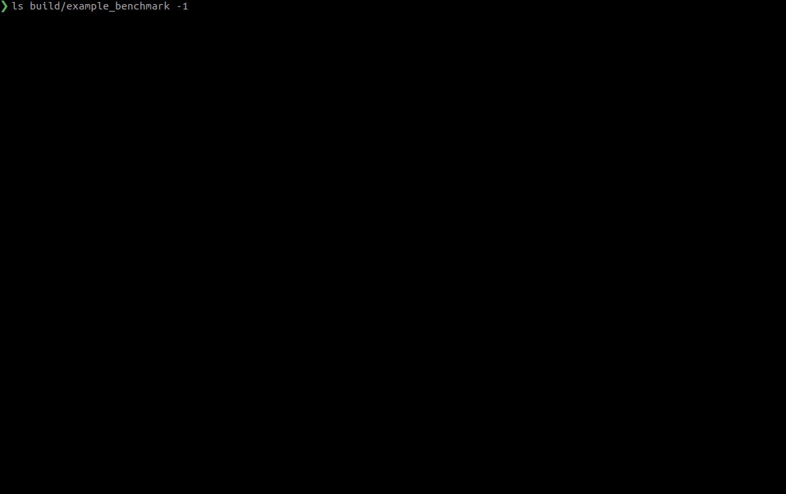

# **beast** - The **be**nchmark **a**nalysis and **s**ummary **t**ool

  

beast is a simple tool to execute and post-process a set of google benchmarks. The basic feature is plotting multiple benchmark results in one single plot (powered by `plotly`). It is also possible to configure access to a mongodb database and push results to it.

## **Installation**

Download the latest release:


and install the ``.deb`` package via ``sudo dpkg -i``.

## **Usage example**

beast will search for executables with a predefined name pattern in your current working directory as a default. Check ``beast --help`` for an overview about possible options. We will use the C++ example from the repo directory to show the basic functionality (of course you will need to clone the repo for that):

``cd`` to the ``example_benchmark`` directory and call:

```bash
cmake --build ../build --target all
```

you will get some small benchmark executables which can be plotted with ``beast``:


