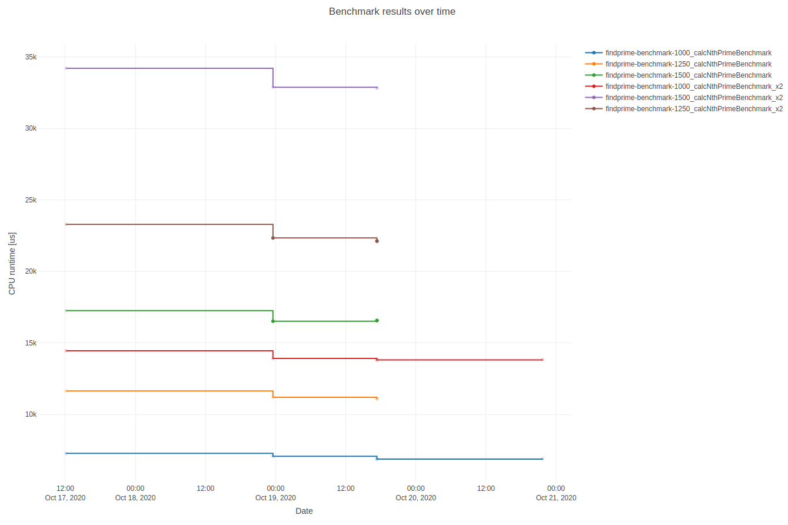
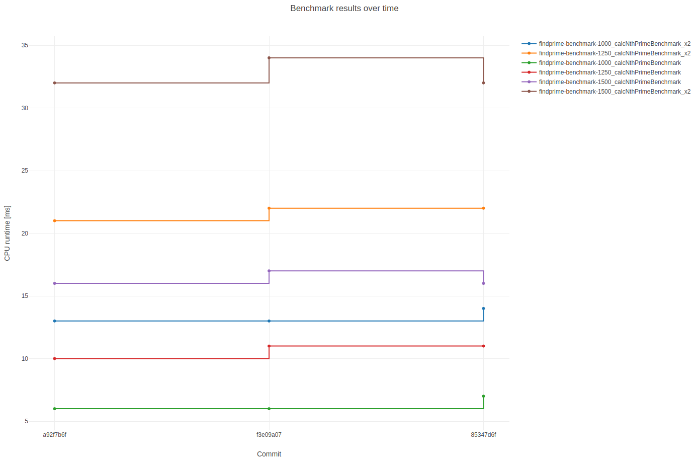

# **beast** - **be**nchmark **a**nalysis and **s**ummary **t**ool

  

``beast`` is a simple tool to execute and post-process a set of google benchmarks. The basic feature is plotting multiple benchmark results in one single plot (powered by `plotly`). It is also possible to configure access to a ``mongoDB`` database and push results to it.

- [Installation](#installation)
- [Basic Usage Example](#basic-usage-example)
- [Database Setup](#database-setup)
- [Repository Benchmarking](#repository-benchmarking)

----------------------------------

## **Installation**

Download the latest release from:

[](https://github.com/bjob/beast/releases/latest)

and install the ``.deb`` package via ``sudo dpkg -i``.

## **Basic Usage Example**

``beast`` will search for executables with a predefined regular expression pattern in your current working directory as a default. Check ``beast --help`` for an overview about possible options. We will use the C++ example from the repo directory to show the basic functionality (of course you will need to clone the repo for that):

``cd`` to the ``example_benchmark`` directory and call:

```bash
mkdir build
cd build
cmake ..
cmake --build . --target all
```

you will get some small benchmark executables which can be plotted with ``beast``:


## **Database Setup**

If you want to use ``beast``'s database related functionality, you need to set up a ``mongoDB`` database, either by installing the Community Edition from [https://docs.mongodb.com/manual/administration/install-community/](https://docs.mongodb.com/manual/administration/install-community/) in your desired environment or by using the cloud based solution [https://www.mongodb.com/cloud/atlas](https://www.mongodb.com/cloud/atlas).

Assuming a successful database setup, the only thing which is left to be done is a little configuration via ``beast config``. Set the ``mongoDB``-URI, the database name and the collection name with the according ``--set...`` commands. Note: The collection does not have to be existent, it will be created with the first push to it.

Finally you should be able to push your most recent generated benchmark results via ``beast dbpush`` or to retrieve and plot previous pushed data with the ``beast dbplot`` command:



## **Repository Benchmarking**

To run benchmarks on a certain commit range of a git repository, you need to provide the needed information in a small `yaml` file.

Example for the `beast` repo:

```yaml
version: 1
repo_path: <PATH_TO_BEAST_REPO> # absolute or relative to cwd
branch_name: master
from_commit: a92f7b6f4e5da30908577b9109040987f6ca9bf6
to_commit: 85347d6fd06acbd700be5237a94ca49486bb5e25
build_commands: |
  mkdir build
  cd build && cmake ..
  cd build && cmake --build . --target all
benchmark_regex: .*benchmark[^.]*$
```

Adapt the `yaml` to your needs and set the path to it with `beast config --set-repocheck-yaml`. Run and plot the benchmarks with `beast repocheck` (check out `--help` for more details).


